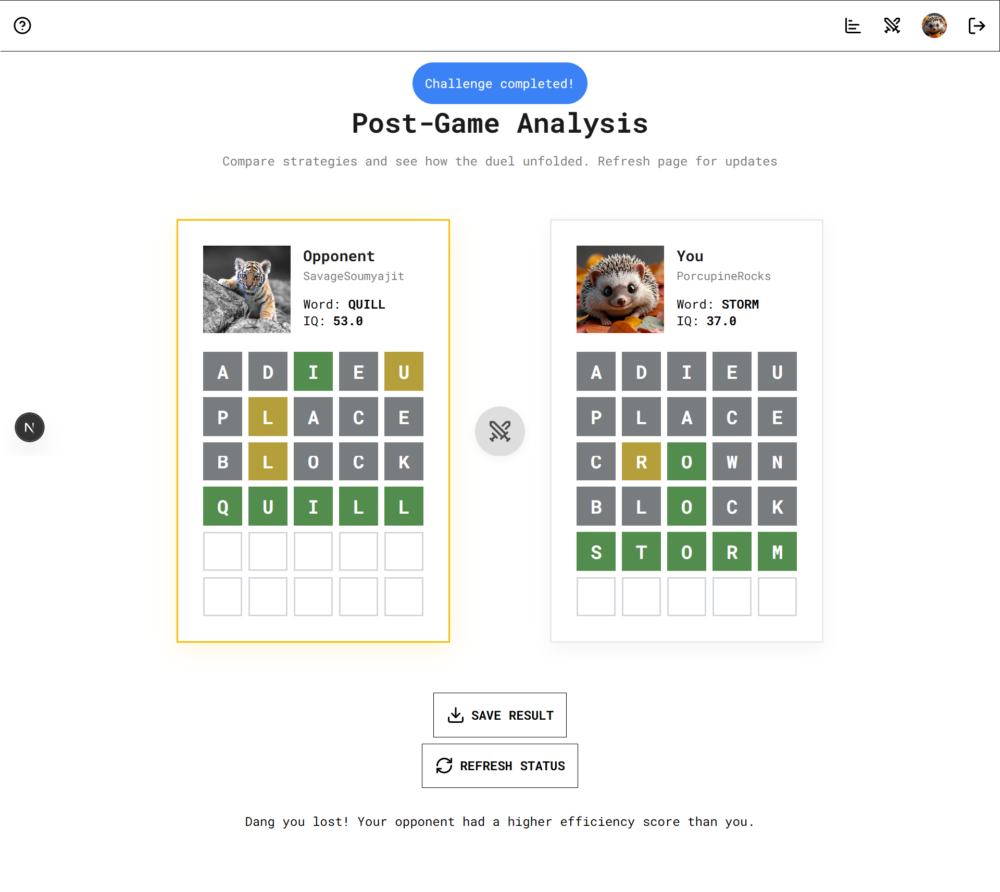

# ForgeWord: The Ultimate Word Challenge Arena

Welcome to **ForgeWord**, a two-player word-based game based on the classic *wordle*. Challenge your friends to guess a word you choose, while you try to guess the word chosen by them. Rule is simple: Whoever guesses, and guesses *better* wins!

**PLAY NOW:** https://forgeword.vercel.app
> Confused whether the game is worth signing up for? *[Play as guest](https://forgeword.vercel.app/challenges/create)* and check it out yourselves!

## How To Play
1. **Host/Join a challenge:** Start a new game and share the link with a friend, or join an existing lobby to accept a challenge.
2. **FORGE your WORD:** Choose a valid 5-letter word for your opponent to guess. Make sure to pick a difficult word!
3. **Start Guessing:** Once the words are chosen, guessing phase begins. Rules are same as in classic wordle game
4. **Result:** The player with the maximum IQ after game finishes wins! Share result with your friends by downloading the game board snapshots or simply sending the status link!

## LICENSING
This project is under [MIT](./LICENSE) license.